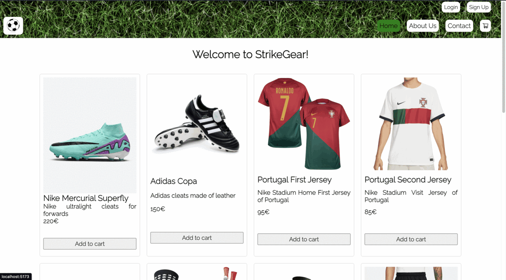

<h1 align="center">StrikeGear </h1>

## 📝 About the project

StrikeGear is an E-commerce, this is a Full Stack project. This is the Front-End repository, if you want to check the Back-End repository here's the link: <a href="https://github.com/nblancoz/E-commerce">

## 💻 Technologies used in the project

  <!--REACT-->
  
  <!--REACT VITE-->
  
  <!--JAVASCRIPT-->
  
  <!--ANTDESIGN-->
  
  <!--SASS-->
  
  <!--NPM-->
  

## 🚀 Summary of the E-commerce

This project consisted in the implementation of the Front-End using react an the technologies mentioned previously. This website is specially made for soccer fans. Here you can buy different products that you may need for practicing this sport, such as cleats, shirts, balls, etc.

## 🫡 Requirements

<ul>
    <li>
    Users: In the website must be a way to create users, besides they must login. When the user is connected, his/her orders should appear as well as his/her information. Finally, they must have the option to logout
    </li>
    <li>
    Products: The products most be shown. In my case, I showed an image of the product, the name, a little description and the price.
    </li>
    <li>
    Orders: There must be a way to create an order and show the products the user is going to buy. I´ve shown the name of the product and the image. Also the user could errayse the products if he/her at the end are not buying.
    </li>
    <li>
    Components: The components could not exceed more than 400 lines of code.
    </li>
    <li>
    Functions: The functions could not exceed more than 75 lines of code.
    </li>
</ul>

### 🖼️ Preview

### 🪪 Licence

This project is under licence of Nicolás Blanco Zappalá

### 📱 Contact

 Nicolás Blanco Zappalá

     

